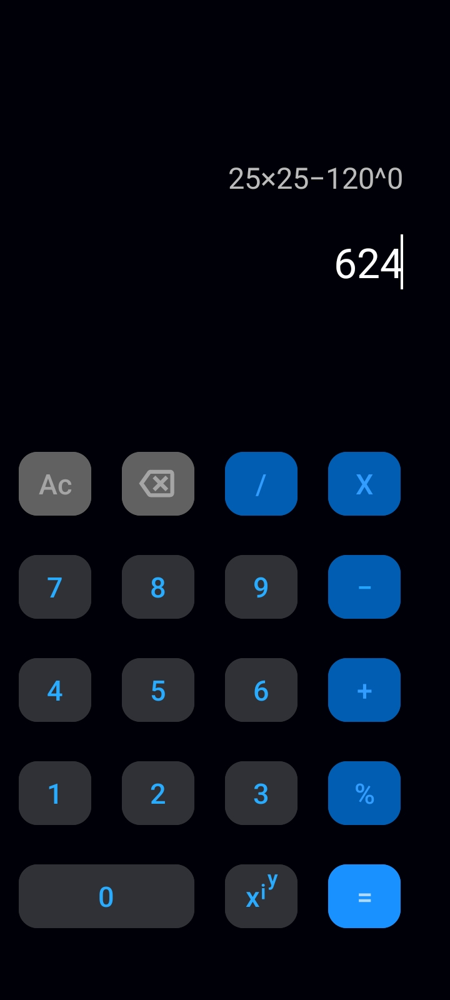

# calC
A calculator app capable of parsing and evaluating multi-operator expressions.  
Uses the **Shunting Yard algorithm** as the underlying logic.

## Features
- Supports multiple operands and operators
- Simple yet appealing UI
- Evaluates expressions according to PEMDAS & Associativity rules
- History of last calculations

## Tech Stack
- Java
- XML

## How to Run
1. Clone this repository.
2. Open in Android Studio.
3. Build & run on an emulator or device.

## Screenshots

## Author
Sadique Khan
